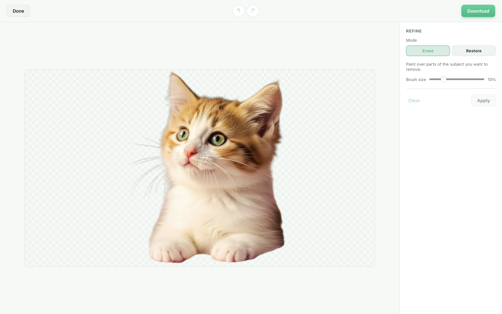
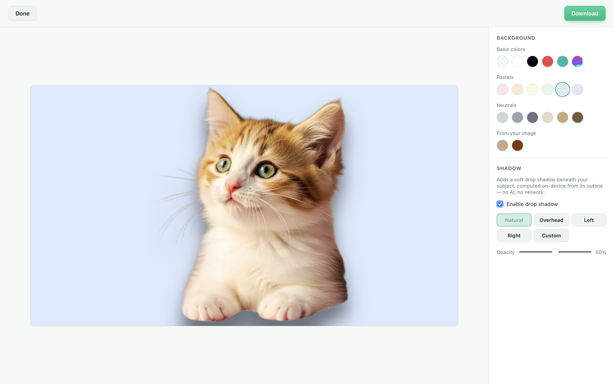
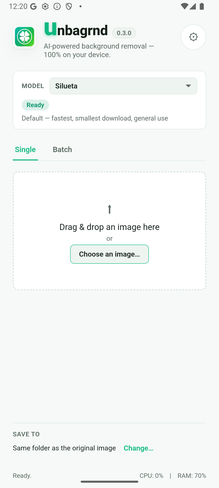
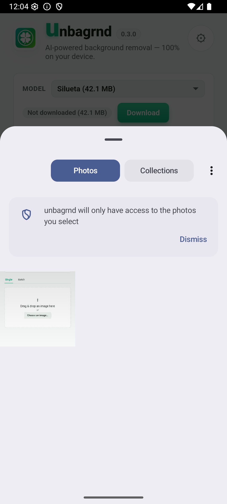

<p align="center">
  
</p>

<h1 align="center">unbagrnd</h1>

<p align="center">
  <a href="../../releases"></a>
  <a href="../../releases"></a>
  <a href="LICENSE"></a>
</p>

<p align="center">
  
  
  
  
</p>

A small desktop app that uses AI to remove the background from images —
entirely on your device. No cloud API, no account, no telemetry, and no
internet access required after a one-time setup step.

- **On-device AI.** Background removal runs through a real neural network
  (ONNX Runtime), inferred locally on your machine. No image, filename, or
  metadata is ever sent anywhere.
- **100% free & open source.** MIT-licensed, built on a free, open-source
  stack — no API keys, no paid tiers, no usage limits.
- **Pick your AI model.** Choose from several background-removal models in
  Settings, trading off speed vs. accuracy. Each downloads once on first use
  (starting at ~43 MB for the default) and is cached locally after that.
- **Offline after setup.** The only network requests the app ever makes are
  those one-time model downloads. Nothing else — no analytics, no update
  checks.
- **Single and batch.** Process one image, or a whole folder, from the same
  window.
- **Refine by hand.** Brush over the result to erase or restore parts of the
  cutout, with undo/redo — for the spots the model gets almost right.
- **Edit the background.** Fill it with a solid color and add an on-device
  drop shadow, no AI or network involved.
- **Export as PNG, WebP, or SVG.** Pick the output format in Settings.
- **Cross-platform.** macOS, Windows, Linux, and Android.

## Screenshots

<p align="center">
  
  
</p>
<p align="center">
  
  
</p>
<p align="center">
  
  
</p>
<p align="center">
  
  
</p>

## Videos

<p align="center">
  <a href="https://www.youtube.com/watch?v=Orb9cPrRR3U">
    
  </a>
  <a href="https://www.youtube.com/watch?v=22xLWuk1i_M">
    
  </a>
</p>
<p align="center">
  <a href="https://www.youtube.com/watch?v=Orb9cPrRR3U">Showcase</a> ·
  <a href="https://www.youtube.com/watch?v=22xLWuk1i_M">Demo</a>
</p>

## How it works

unbagrnd runs [IS-Net "general use"](https://github.com/danielgatis/rembg)
(Apache-2.0, from Qin et al., *"Highly Accurate Dichotomous Image
Segmentation"*, ECCV 2022) as an ONNX model, via the [`ort`](https://ort.pyke.io/)
Rust bindings for ONNX Runtime. This is the same model family used by the
popular `rembg` Python tool. The whole pipeline — decode, resize, normalize,
run the model, turn its predicted mask into an alpha channel, re-encode as
PNG — happens in the Rust backend; the frontend never touches the network.

## Installing

Grab the installer for your platform from the
[Releases](../../releases) page:

- **macOS:** `.dmg` (Apple Silicon only — the on-device ML runtime this app
  depends on no longer ships prebuilt binaries for Intel Macs)
- **Windows:** `.msi` / `.exe`
- **Linux:** `.AppImage` / `.deb`
- **Android:** `.apk` / `.aab` — release-signed, installs and upgrades
  in-place like any other app (see [Android](#android) below for building
  one yourself)

On first launch, or the first time you remove a background, unbagrnd
downloads the model (~170 MB) and shows a progress bar while it does. That
only happens once — every run after that is fully offline.

### macOS: "unbagrnd is damaged and can't be opened"

This build isn't code-signed or notarized (that requires a paid Apple
Developer account), so Gatekeeper quarantines it after download and shows
this message — the app itself isn't actually damaged. Clear the quarantine
flag once, after moving it to Applications:

```sh
xattr -cr /Applications/unbagrnd.app
```

## Development

Requires:

- [Node.js](https://nodejs.org/) 20+
- A recent stable **Rust** (1.88+), installed via [rustup](https://rustup.rs/)
  — not your OS package manager's `rustc`, which is often too old to build
  the ONNX Runtime bindings this app depends on.
- The platform build tools Tauri needs — see the
  [Tauri prerequisites guide](https://v2.tauri.app/start/prerequisites/) for
  your OS (on Debian/Ubuntu: `libwebkit2gtk-4.1-dev`, `libssl-dev`,
  `libayatana-appindicator3-dev`, `librsvg2-dev`, plus standard build tools).

```sh
npm install       # install frontend dependencies
npm run tauri dev # run the app in dev mode, with hot reload
```

### Building a release installer

```sh
npm run tauri build
```

Produces a native installer for your current OS in
`src-tauri/target/release/bundle/`.

### Android

Every tagged release already ships a release-signed `.apk`/`.aab` (see
[Releases](../../releases)) — installs and upgrades in-place like any
other app. Build one yourself only if you want to develop against a
connected device/emulator. Requires the Android SDK, an NDK, and
JDK 17+ (`ANDROID_HOME` and `NDK_HOME` set), on top of the prerequisites
above:

```sh
npx tauri android init   # first time only, scaffolds gen/android
npx tauri android dev    # run on a connected device/emulator, hot reload
npx tauri android build --target aarch64          # signed release APK
npx tauri android build --target aarch64 --debug  # unsigned debug APK (huge - unstripped)
```

The release APK lands at
`src-tauri/gen/android/app/build/outputs/apk/universal/release/app-universal-release.apk`.
It's only installable if it's signed: generate a keystore once and point
`src-tauri/gen/android/keystore.properties` at it (both are gitignored, and
the build falls back to unsigned if the properties file is missing):

```sh
cd src-tauri/gen/android/app
keytool -genkeypair -v -keystore unbagrnd-upload-key.jks -alias unbagrnd \
  -keyalg RSA -keysize 2048 -validity 10000
cat > ../keystore.properties <<EOF
storeFile=unbagrnd-upload-key.jks
storePassword=<the password you just set>
keyAlias=unbagrnd
keyPassword=<the same password - PKCS12 keystores don't support separate ones>
EOF
```

Android's OS-native certificate verifier has a
[known, unfixed bug](https://github.com/rustls/rustls-platform-verifier/issues/221)
where it reports any CRL-only certificate (no OCSP URL — the norm since
Let's Encrypt dropped OCSP support in 2025) as revoked, which broke the
model download outright. Worked around in `models.rs`'s `http_client()`: on
Android the download client is built with a bundled Mozilla root store
instead of going through the platform verifier at all.

Picked/dropped images can't be read with plain `std::fs` on Android: the
file/photo picker hands back a `content://` URI, not a real filesystem
path. `commands.rs`'s `open_image` goes through the `tauri-plugin-fs`
plugin instead, which knows how to resolve those via the OS's
ContentResolver. For the same reason, `output_path_for` can't always save
"next to the source file" on Android (a content URI has no real parent
directory) - it falls back to a directory inside the app's own storage.

### Running the Rust test suite

```sh
cargo test --workspace   # run from the repo root - covers core, src-tauri and api
```

Most of the backend is covered by ordinary `cargo test`. The one exception
is the end-to-end inference test in `core` (decode → preprocess → run the
model → composite the alpha channel), which needs a real cached model file
and is skipped by default so a fresh clone doesn't need a 170 MB download
just to run `cargo test`. To run it locally:

```sh
UNBAGRND_TEST_MODEL_KEY=silueta \
UNBAGRND_TEST_MODEL_PATH=/path/to/silueta.onnx \
UNBAGRND_TEST_IMAGE_PATH=/path/to/a/photo.jpg \
cargo test --release removes_background_from_a_real_photo -- --nocapture
```

`api`'s own tests (`cargo test -p unbagrnd-api`) exercise the real Axum
router end to end (auth, key lifecycle, image validation) against a
throwaway SQLite file, no model or network access needed.

### Releasing

Pushing a tag matching `v*` (e.g. `v0.3.3`) triggers
[`.github/workflows/build.yml`](.github/workflows/build.yml), which builds
installers for macOS (Apple Silicon + Intel), Windows, and Linux, builds a
debug-signed Android APK/AAB, and attaches all of it to a draft GitHub
release.

## API

A self-hosted REST API wrapping the exact same on-device background-removal
core the desktop app uses — no cloud, no account, no image ever sent
anywhere but your own server.

### Architecture

```text
                 unbagrnd
                     |
          +----------+----------+
          |                     |
     Desktop App             API Server
       (Tauri)                 (Axum)
          |                     |
          +----------+----------+
                     |
              unbagrnd-core
           (models.rs, bg_remove.rs)
                     |
              ONNX Runtime
```

`core/` has the one and only background-removal implementation (model
catalog, download/caching, ONNX Runtime inference) — both the desktop app
and the API wrap it, neither reimplements it. See
[Project structure](#project-structure) above.

### Quick start

```sh
git clone https://github.com/zidniryi/unbagrnd.git
cd unbagrnd
cp .env.example .env
# edit .env and set UNBAGRND_ADMIN_KEY (e.g. `openssl rand -hex 32`)
docker compose up --build
```

```sh
curl http://localhost:8080/health
# {"status":"ok"}
```

Interactive API docs (Swagger UI): `http://localhost:8080/docs`. A ready-made
Postman collection is at
[`docs/unbagrnd-api.postman_collection.json`](docs/unbagrnd-api.postman_collection.json).

### Environment variables

See [`.env.example`](.env.example) for the full, commented list. The
important ones:

| Variable                             | Default                       | Meaning                                             |
| ------------------------------------- | ------------------------------ | ---------------------------------------------------- |
| `HOST` / `PORT`                       | `0.0.0.0` / `8080`             | Where the server listens                             |
| `DATABASE_URL`                        | `sqlite:///data/unbagrnd.db`   | API key metadata storage                             |
| `UNBAGRND_ADMIN_KEY`                  | *(unset)*                      | Required for `/v1/keys` — see below                  |
| `UNBAGRND_MODEL_KEY`                  | `silueta`                      | Which model to load at startup                       |
| `UNBAGRND_MODELS_DIR`                 | `/models`                      | Where the model is cached                            |
| `UNBAGRND_MAX_FILE_SIZE_MB`           | `20`                           | Upload size limit                                    |
| `UNBAGRND_MAX_IMAGE_WIDTH` / `HEIGHT` | `8192`                         | Image dimension limit                                |
| `UNBAGRND_MAX_CONCURRENT_INFERENCES`  | `2`                            | Bounds simultaneous `remove-background` calls        |
| `UNBAGRND_MAX_BATCH_SIZE`             | `10`                           | Max images per `remove-background/batch` request     |
| `UNBAGRND_RATE_LIMIT_PER_MINUTE`      | `60`                           | Per-API-key limit; `0` disables it; resets on restart |
| `UNBAGRND_CORS_ORIGINS`               | `*`                            | Comma-separated allowlist, or `*`                     |

### API key management

Every `/v1/keys` route requires `X-Admin-Key: $UNBAGRND_ADMIN_KEY` — a
regular API key (the kind handed out below to callers of
`/v1/remove-background`) can never create, list or revoke other keys. If
`UNBAGRND_ADMIN_KEY` isn't set, these routes are disabled (`503`) rather
than falling back to some default credential.

```sh
curl -X POST http://localhost:8080/v1/keys \
  -H "X-Admin-Key: $UNBAGRND_ADMIN_KEY" \
  -H "Content-Type: application/json" \
  -d '{"name": "my-production-key"}'
# {"id":"...","name":"my-production-key","api_key":"unb_live_...","created_at":"..."}
```

`api_key` is only ever returned here, at creation time — only its SHA-256
hash is stored (see `key_hash` in `migrations/0001_api_keys.sql`), so save
it now. `GET /v1/keys` lists metadata only (never the key or its hash);
`DELETE /v1/keys/{id}` revokes it immediately (soft-deleted, so
`revoked_at` stays as an audit trail).

### Removing a background

```sh
curl -X POST http://localhost:8080/v1/remove-background \
  -H "X-API-Key: unb_live_xxxxxxxxx" \
  -F "image=@photo.jpg" \
  --output result.png
```

Returns a transparent PNG (`Content-Type: image/png`). The upload is
processed in memory and discarded — nothing about it is written to disk or
logged.

### Batch

```sh
curl -X POST http://localhost:8080/v1/remove-background/batch \
  -H "X-API-Key: unb_live_xxxxxxxxx" \
  -F "images=@photo1.jpg" \
  -F "images=@photo2.jpg" \
  -F "images=@photo3.jpg"
```

Up to `UNBAGRND_MAX_BATCH_SIZE` images in one request (repeat the `images`
field, one per file). Always returns `200` with one result per image, in
upload order — a single corrupt or unreadable file doesn't fail the rest of
the batch:

```json
{
  "results": [
    { "filename": "photo1.jpg", "status": "ok", "image_base64": "..." },
    { "filename": "photo2.jpg", "status": "ok", "image_base64": "..." },
    { "filename": "photo3.jpg", "status": "error", "error": { "code": "UNSUPPORTED_IMAGE", "message": "..." } }
  ]
}
```

Every item still goes through the same `UNBAGRND_MAX_CONCURRENT_INFERENCES`
semaphore a single `/v1/remove-background` call does, so a large batch
queues internally rather than spiking resource usage.

### Endpoints

| Method   | Path                            | Auth            | Description                          |
| -------- | -------------------------------- | ---------------- | ------------------------------------- |
| `GET`    | `/health`                        | none             | Liveness check                        |
| `POST`   | `/v1/keys`                       | `X-Admin-Key`    | Create an API key                     |
| `GET`    | `/v1/keys`                        | `X-Admin-Key`    | List API key metadata                 |
| `DELETE` | `/v1/keys/{id}`                   | `X-Admin-Key`    | Revoke an API key                     |
| `POST`   | `/v1/remove-background`           | `X-API-Key`      | Remove one image's background         |
| `POST`   | `/v1/remove-background/batch`     | `X-API-Key`      | Remove backgrounds from up to `UNBAGRND_MAX_BATCH_SIZE` images |
| `GET`    | `/docs`                           | none             | Swagger UI                            |

Errors are always JSON: `{"error": {"code": "INVALID_API_KEY", "message": "..."}}`.

### Security & privacy

- API keys: `unb_live_` + 256 bits of CSPRNG-generated entropy, SHA-256
  hashed at rest, compared in constant time. Never logged (only the
  safe-to-display `key_prefix` is).
- Upload size, image dimensions, inference concurrency and per-key request
  rate are all bounded and configurable.
- Nothing this server processes is sent to any third party. There's no
  analytics, no telemetry, and no dependency on any unbagrnd-operated
  service — it's exactly as self-contained as the desktop app.

### Development (without Docker)

```sh
cp .env.example .env   # set UNBAGRND_ADMIN_KEY
cargo run -p unbagrnd-api
```

`UNBAGRND_MODELS_DIR`/`DATABASE_URL` default to `/models`/`/data`, which
won't be writable outside a container — override both to local paths in
`.env` (e.g. `./tmp/models`, `sqlite://./tmp/unbagrnd.db`) for local runs.

### Production deployment

Put a reverse proxy (Caddy, nginx, Traefik, ...) in front of it for TLS;
`unbagrnd-api` itself only speaks plain HTTP. Restrict
`UNBAGRND_CORS_ORIGINS` to your actual frontend origin(s) rather than `*`,
and treat `UNBAGRND_ADMIN_KEY` like any other production secret (a real
secrets manager, not a checked-in `.env`).

## Where the model is cached, and how to clear it

The model is stored in the app's local data directory, named after the app
identifier (`com.unbagrnd.app`):

| OS      | Path                                                         |
| ------- | -------------------------------------------------------------|
| macOS   | `~/Library/Application Support/com.unbagrnd.app/`             |
| Linux   | `~/.local/share/com.unbagrnd.app/`                             |
| Windows | `%APPDATA%\com.unbagrnd.app\`                                  |
| Android | `/data/user/0/com.unbagrnd.app/models/` (app-private storage) |

To clear the cached model (freeing ~170 MB, or to force a clean re-download),
delete that folder, or just the `isnet-general-use.onnx` file inside it. The
app will re-download it the next time it's needed. On Android, that folder
isn't user-browsable without root/`adb`, so use in-app Settings ("Clear
model") instead, or just uninstall the app.

## Project structure

A Cargo workspace with three Rust members: the shared inference core, the
Tauri desktop app, and the self-hosted REST API — see [API](#api) below for
why it's split this way.

```
unbagrnd/
  Cargo.toml                # workspace root (members: core, src-tauri, api)
  src/                       # desktop frontend: plain HTML/CSS/JS, no framework
    index.html
    styles.css
    main.js
  core/                      # unbagrnd-core: the one background-removal implementation
    src/
      models.rs               # model catalog + download/caching (host-agnostic)
      bg_remove.rs             # preprocessing, inference, postprocessing
  src-tauri/                 # desktop app - wraps core with Tauri commands
    src/
      lib.rs                   # app entrypoint, plugin & command registration
      commands.rs              # Tauri commands exposed to the frontend
      models.rs                # thin AppHandle wrapper around core::models
      background.rs, refine.rs # background-fill/shadow and manual mask refine
      settings.rs, system_usage.rs
  api/                        # unbagrnd-api: self-hosted REST API - wraps core with Axum
    src/
      main.rs, config.rs, state.rs, error.rs, openapi.rs
      auth/                    # X-API-Key / X-Admin-Key extractors
      db/                      # SQLite (sqlx) - API key metadata
      routes/                  # /health, /v1/keys, /v1/remove-background
    tests/api_test.rs
  migrations/                 # sqlx SQL migrations for the API's SQLite database
  Dockerfile, docker-compose.yml, .env.example
  .github/workflows/
    build.yml                  # cross-platform desktop + Android release builds
```

## License

MIT — see [LICENSE](LICENSE). Free for personal and commercial use.

The bundled model, [IS-Net "general use"](https://github.com/danielgatis/rembg/releases/download/v0.0.0/isnet-general-use.onnx),
is Apache-2.0 licensed and downloaded from `rembg`'s (MIT-licensed) GitHub
release assets — see [How it works](#how-it-works) above.

## Contributing

Issues and pull requests are welcome. This is a small, focused tool; the
[non-negotiable constraints](#unbagrnd) above (local-only, free, offline
after setup) apply to any contribution.
