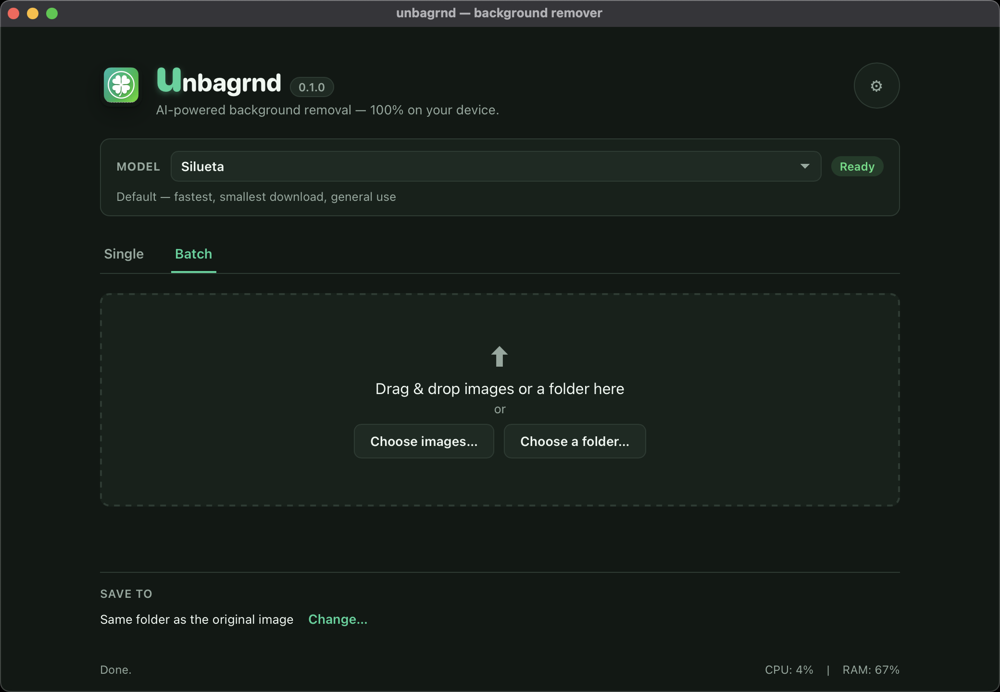
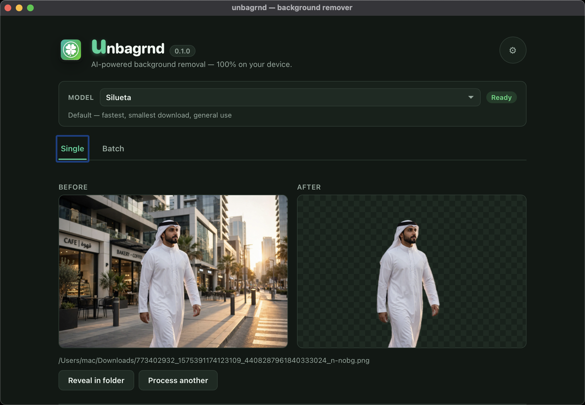
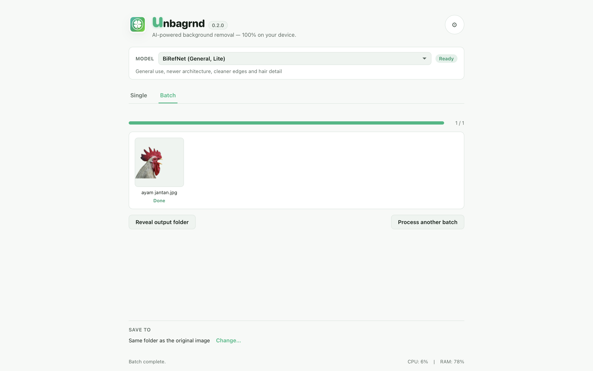
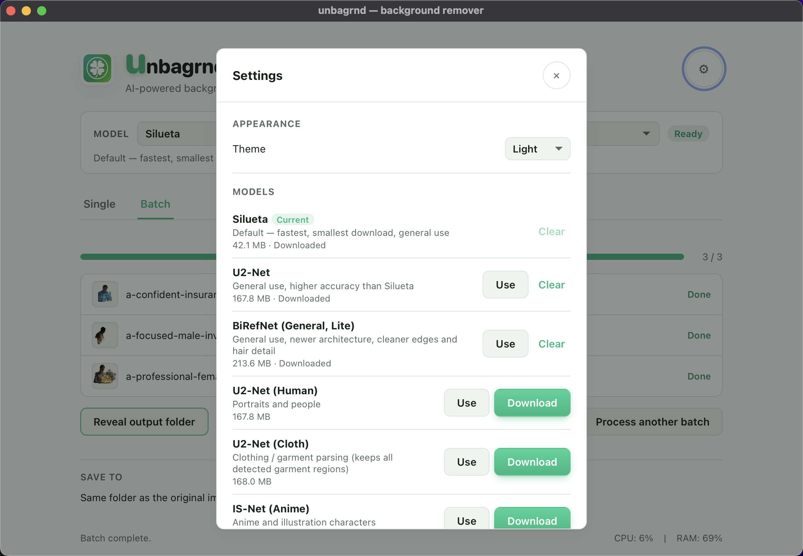

<p align="center">
  
</p>

<h1 align="center">unbagrnd</h1>

A small desktop app that uses AI to remove the background from images —
entirely on your device. No cloud API, no account, no telemetry, and no
internet access required after a one-time setup step.

- **On-device AI.** Background removal runs through a real neural network
  (ONNX Runtime), inferred locally on your machine. No image, filename, or
  metadata is ever sent anywhere.
- **100% free & open source.** MIT-licensed, built on a free, open-source
  stack — no API keys, no paid tiers, no usage limits.
- **Pick your AI model.** Choose from several background-removal models in
  Settings, trading off speed vs. accuracy. Each downloads once on first use
  (starting at ~43 MB for the default) and is cached locally after that.
- **Offline after setup.** The only network requests the app ever makes are
  those one-time model downloads. Nothing else — no analytics, no update
  checks.
- **Single and batch.** Process one image, or a whole folder, from the same
  window.
- **Cross-platform.** macOS, Windows, and Linux.

## Screenshots

<p align="center">
  
  
</p>
<p align="center">
  
  
</p>

## How it works

unbagrnd runs [IS-Net "general use"](https://github.com/danielgatis/rembg)
(Apache-2.0, from Qin et al., *"Highly Accurate Dichotomous Image
Segmentation"*, ECCV 2022) as an ONNX model, via the [`ort`](https://ort.pyke.io/)
Rust bindings for ONNX Runtime. This is the same model family used by the
popular `rembg` Python tool. The whole pipeline — decode, resize, normalize,
run the model, turn its predicted mask into an alpha channel, re-encode as
PNG — happens in the Rust backend; the frontend never touches the network.

## Installing

Grab the installer for your platform from the
[Releases](../../releases) page:

- **macOS:** `.dmg` (Apple Silicon only — the on-device ML runtime this app
  depends on no longer ships prebuilt binaries for Intel Macs)
- **Windows:** `.msi` / `.exe`
- **Linux:** `.AppImage` / `.deb`

On first launch, or the first time you remove a background, unbagrnd
downloads the model (~170 MB) and shows a progress bar while it does. That
only happens once — every run after that is fully offline.

## Development

Requires:

- [Node.js](https://nodejs.org/) 20+
- A recent stable **Rust** (1.88+), installed via [rustup](https://rustup.rs/)
  — not your OS package manager's `rustc`, which is often too old to build
  the ONNX Runtime bindings this app depends on.
- The platform build tools Tauri needs — see the
  [Tauri prerequisites guide](https://v2.tauri.app/start/prerequisites/) for
  your OS (on Debian/Ubuntu: `libwebkit2gtk-4.1-dev`, `libssl-dev`,
  `libayatana-appindicator3-dev`, `librsvg2-dev`, plus standard build tools).

```sh
npm install       # install frontend dependencies
npm run tauri dev # run the app in dev mode, with hot reload
```

### Building a release installer

```sh
npm run tauri build
```

Produces a native installer for your current OS in
`src-tauri/target/release/bundle/`.

### Running the Rust test suite

```sh
cd src-tauri
cargo test
```

Most of the backend is covered by ordinary `cargo test`. The one exception
is the end-to-end inference test (decode → preprocess → run the model →
composite the alpha channel), which needs a real cached model file and is
skipped by default so a fresh clone doesn't need a 170 MB download just to
run `cargo test`. To run it locally:

```sh
UNBAGRND_TEST_MODEL_PATH=/path/to/isnet-general-use.onnx \
UNBAGRND_TEST_IMAGE_PATH=/path/to/a/photo.jpg \
cargo test --release removes_background_from_a_real_photo -- --nocapture
```

### Releasing

Pushing a tag matching `v*` (e.g. `v0.2.0`) triggers
[`.github/workflows/build.yml`](.github/workflows/build.yml), which builds
installers for macOS (Apple Silicon + Intel), Windows, and Linux, and
attaches them to a draft GitHub release.

## Where the model is cached, and how to clear it

The model is stored in the app's local data directory, named after the app
identifier (`com.unbagrnd.app`):

| OS      | Path                                                         |
| ------- | -------------------------------------------------------------|
| macOS   | `~/Library/Application Support/com.unbagrnd.app/`             |
| Linux   | `~/.local/share/com.unbagrnd.app/`                             |
| Windows | `%APPDATA%\com.unbagrnd.app\`                                  |

To clear the cached model (freeing ~170 MB, or to force a clean re-download),
delete that folder, or just the `isnet-general-use.onnx` file inside it. The
app will re-download it the next time it's needed.

## Project structure

```
unbagrnd/
  src/                    # frontend: plain HTML/CSS/JS, no framework
    index.html
    styles.css
    main.js
  src-tauri/
    src/
      lib.rs              # app entrypoint, plugin & command registration
      commands.rs          # Tauri commands exposed to the frontend
      model.rs             # one-time model download, caching, checksum
      bg_remove.rs          # preprocessing, inference, postprocessing
  .github/workflows/
    build.yml              # cross-platform release builds
```

## License

MIT — see [LICENSE](LICENSE). Free for personal and commercial use.

The bundled model, [IS-Net "general use"](https://github.com/danielgatis/rembg/releases/download/v0.0.0/isnet-general-use.onnx),
is Apache-2.0 licensed and downloaded from `rembg`'s (MIT-licensed) GitHub
release assets — see [How it works](#how-it-works) above.

## Contributing

Issues and pull requests are welcome. This is a small, focused tool; the
[non-negotiable constraints](#unbagrnd) above (local-only, free, offline
after setup) apply to any contribution.
